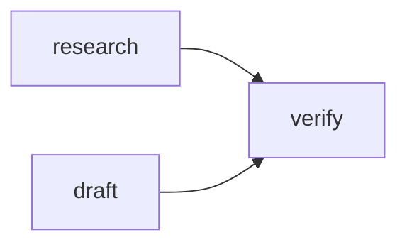

import DiagramPanel from "../../../components/DiagramPanel.astro";

`Pipeline.runDetailed()` executes dependency levels in parallel (`execution.mode = "level_parallel"`) and preserves deterministic ordering by level.

## Retry policy surface

- `retries`
- `backoffMs`
- `jitterMs`
- `retryIf`: `error`, `execution_error`, or `contract_violation`

## Conditional execution

Use `when(context)` to gate a task. Skipped tasks appear with:

- `status: "skipped"`
- `skip_reason`

<DiagramPanel title="Execution shape">

</DiagramPanel>
